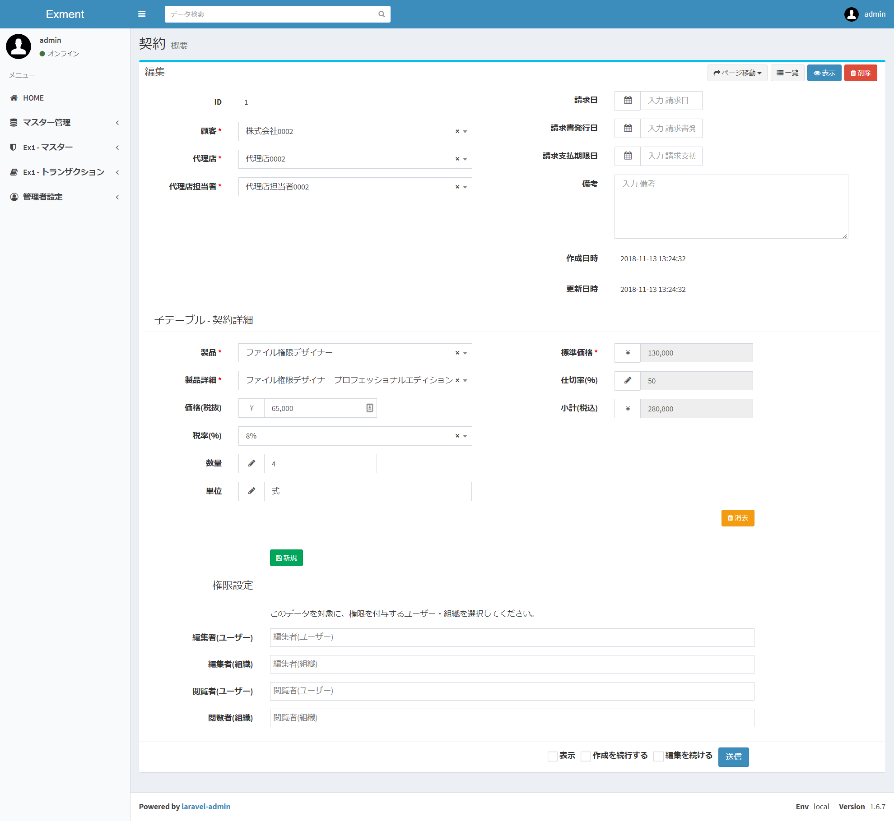
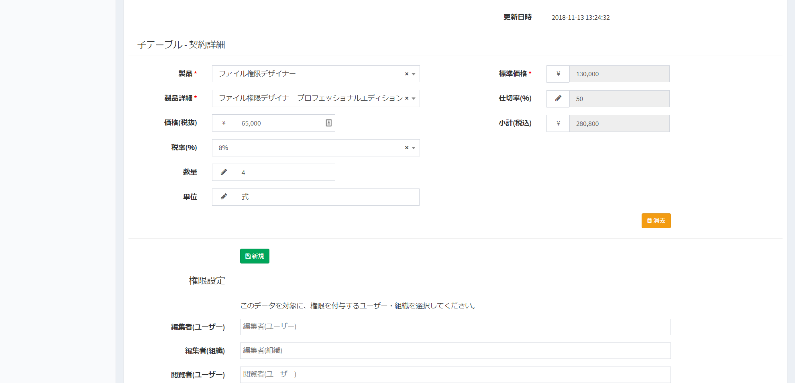

# Data registration
Displays a form for creating and editing data in Exment.  
Items displayed on the form screen are determined by the settings of [Custom column setting](/column.md), custom form, and [Related table](/relation.md).  
If the display is not as expected, you need to configure the settings on the above page. 

## Functions list
  

- "Move to page" button：  
Switches to the screen for changing the settings of the currently displayed custom table.  

- "List" button:：  
Switches to the data list screen.  

- "Display" button:  
Switch to the screen for browsing data.  

- "Delete" button:   
Deletes thedisplayed data.   
※The displayed data cannot be deleted.

- Form item：  
Change the value of the data.  
Items displayed on the form screen are determined by the settings of [Custom column setting](/column.md), custom form, and [Related table](/relation.md).  
If the display is not as expected, you need to configure the settings on the above page.  

- Child table:  
If you set 1: n or n: n in [Related Table](/relation.md), you can also add / change the data of the table set in Related Table.  

## detail of function

### Child table
If you set 1: n or n: n in [Related Table](/relation.md), you can also add / change the data of the table set in Related Table.
Example: If the displayed table item is "Contract" and the child table is "Contract Details", the billing date and customer information can be registered, and at the same time, the detail data of the contract can be added or changed.
  
  
※There are two ways to display child table data: "Normal form format" and "Table format".  
Change the format on the custom form screen.  
  
- "New" button:    
Add one child table data.    
  
- "Delete button":  
Delete the data of the selected child table.  