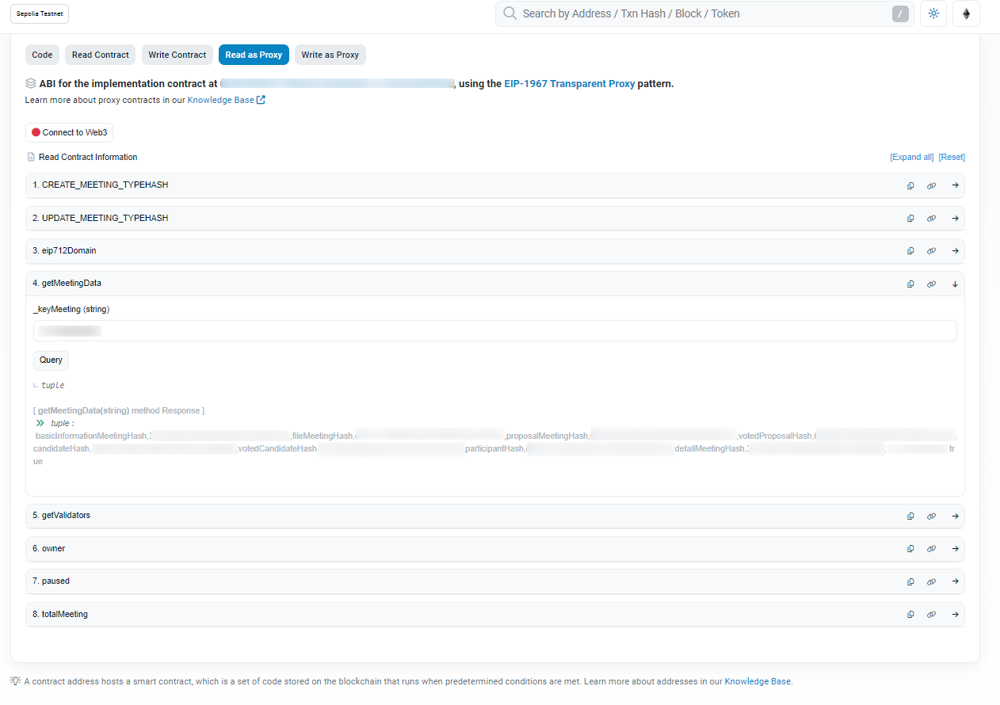

# Cocokitene のコンセプト
会議の情報をすべて暗号化し、管理のためにブロックチェーンにアップロードします。

### 前提
ブロックチェーンに保存するには、会議は2つの条件を満たす必要があります。
1. 会議のステータスは「終了」
2. 投票時間が切れる

#### ハッシュデータ一覧
| キー | 変数 |
| ---- | ---- |
| basic_infor | MD5-1 |
| file_mtg | MD5-2 |
| proposal_mtg・file_proposal_mtg | MD5-3 |
| voting_proposal | MD5-4 |
| candidate | MD5-5 |
| voting_candidate | MD5-6 |
| participant_mtg | MD5-7 |
| total_mtg | MD5-8 |

## 会議データの正確性を認証します
ブロックチェーンにデータをアップロードした後、ユーザーはdAppでデータの正確性を確認できます。

システムの処理流れは以下です：

| キー | 説明 |
| ---- | ---- |
| DB_MD5 | データのチェック時点のMD5ハッシュコード |
| BLC_MD5 | 必要条件を満たす会議の際に、MD5ハッシュコードがブロックチェーンにアップロードされました |

2つのハッシュコードを比較した結果、以下のような結果通知が表示されます。

| コード比較 | 結果 | メッセージ内容 |
| ---- | ---- | ---- |
| MD5-8 | OK |会議データが一致する |
| MD5-7　| NG |参加者のデータが変更されました|
| MD5-6 | NG |役員選挙結果データが変更されました |
| MD5-5　| NG |役員選挙データが変更されました |
| MD5-4 | NG |議決投票データが変更されました |
| MD5-3　| NG |議決データが変更されました |
| MD5-2　| NG |会議ファイルデータが変更されました |
| MD5-1　| NG |基本情報データが変更されました |

