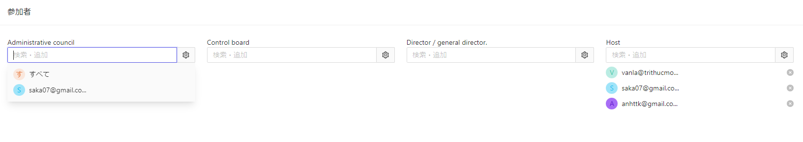

# 株主総会の概要
Cocokiteneにおける、取締役総会についてご説明します。  

取締役総会では、株主総会と同様に、招集、投票などの全ての機能を備えており、
さらにこの総会での選挙も可能です。

## 株主に招待メール送信
「株主にメールを送信」ボタンを押下すると、メールは自動に送信します。

メールのイメージは[こちら](/ja/mail)をご覧ください。

## ファイル添付
改正決議・決議・総会事録・総会集合を追跡するために、画面上に表示される情報に加えて、ファイルの追加機能もあります。
これらのファイルの最大容量は20MBであり、docx、excel、pdfの形式を受け付けます。

> 改正決議・決議の場合、タイトルや詳細などの情報を入力する必要があり、その後に「ファイルを追加」ボタンが表示されます。

## 投票
株主総会では、「一人毎に、1票」で決まります。
詳細は[こちら](/ja/vote)をご覧ください。

## 選挙
会議での信任また不信任は、
役職と立候補者の名前を含む基本情報を使用して行うことができます。
### 総会作成画面

### 総会詳細画面

## 参加者を追加・検索
一番下に参加者を追加・検索することができます。
入力したキーワードを含む（部分一致）データが結果に表示されます。
一人が複数の役割を持つことができ、総会に参加する際に、複数の立場で招待できます。

