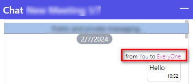

# チャットの概要
Cocokiteneのチャット機能について記載します。
会議参加者の連携とスムーズな情報交換を促進するために、チャット機能が生み出されました。 
取締役会と株主総会内にチャット機能があります。

## チャット機能について
チャットにて、基本的に２つの種類があり、公開とプライベート（個人的）です。 
ユーザーの目的により、それぞれの種類を適用します。

### 公開チャット
公開チャットは複数の参加者間で共有される、オープンな形式のチャットです。
公開チャットにしたい場合、送信先の箇所にて、「EveryOne」を選択します。

##### メッセージ送信元の表示：

##### メッセージ送信先の表示：

### プライベートチャット（個人的なチャット）
個人的なチャットは特定の2人間で行われる非公開のチャットのことを指します。
個人的なチャットにしたい場合、２つ方法はあります。
1. 送信先から対象を選択します。

2. メッセージの送信元を押下します。 

## チャットコントロール
※この機能は会議の役割は「Host」のみ使用できます。
チャットの右奥に「パーミッション設定」ボタンが表示されます。
こちらボタンを押下すると、チャットのパーミッション設定できます。

パーミッションの意味は以下で説明します。

| 種類 | 説明 |
| ---- | ---- |
| ホストのみチャット可能 | ホスト役割のみチャットできます |
| 公開チャットのみ可能 | 全ユーザーが公開チャットできます |
| 公開チャットとプライベートチャット可能 | 全ユーザーが公開とプライベートチャットできます |

| 種類 | 対象 | 公開チャット | プライベートチャット |
| ---- | ---- | ---- | ---- |
| ホストのみチャット可能 | ホスト |　〇 |　〇 |
| 　| 一般的なユーザー |　ー|　ー |
| 公開チャットのみ可能 | ホスト |　〇 |ー |
| 　| 一般的なユーザー |　〇 |ー |
| 公開チャットとプライベートチャット可能 | ホスト |　〇 |　〇 |
| 　| 一般的なユーザー |　〇 |　〇 |

### メッセージリアクション
相手のメッセージに絵文字を挿入または返事できます。

#### 絵文字を挿入
現時点では、5つの絵文字が追加され、相手先のメッセージに挿入でき、 
絵文字を使うことで、単なるテキストだけでは伝わりにくい感情や雰囲気を、視覚的にも表すことができます。

#### メッセージ返事
ここでは、相手のメッセージに対して自由に返事できるため、情報交換がスムーズに行えます。 
メッセージへの返信アイコンを押下すると、自動的にチャット画面の上に相手のメッセージが表示されます。 
これにより、自分がどのメッセージに返信しているのかを簡単に確認できるようになります。

メッセージの返事は、元のメッセージの性質によって決まるということです。

具体的には:

- 公開チャンネルでの公開メッセージに対する返信も公開される
- プライベートチャンネルでのプライベートメッセージに対する返信もプライベートとなる

つまり、メッセージの公開/プライベート属性は、返信メッセージにも引き継がれるということです。

