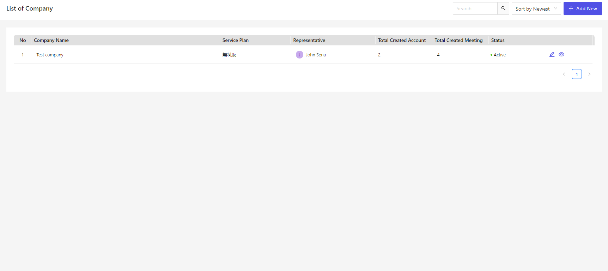
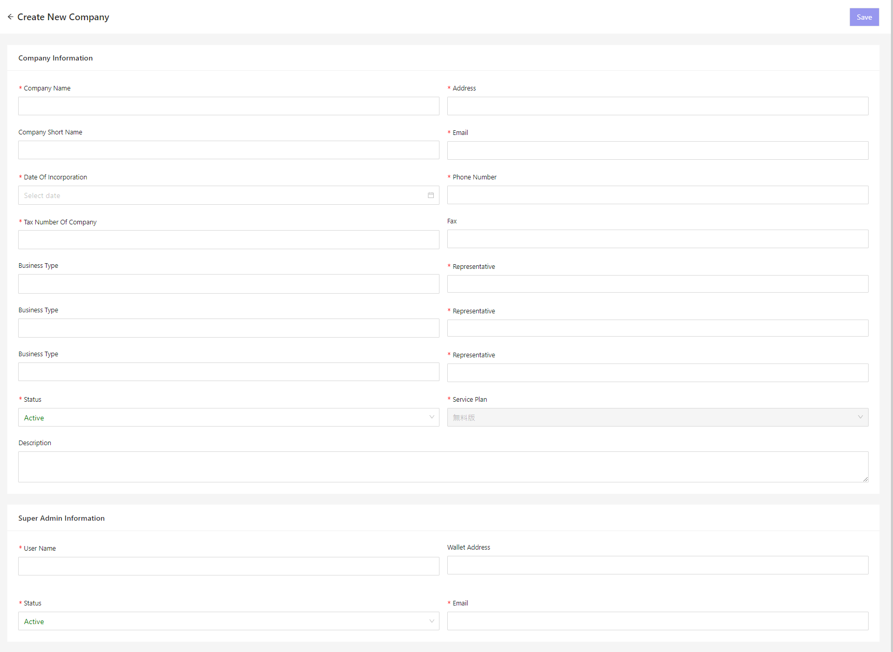

# 会社
Cocokiteneの組織情報の管理を行います。

> 組織の設定を行う前に、[Cocokiteneにおける役割・権限の概要](/ja/permission)ページのご確認を推奨しております。

## 会社管理
会社情報を管理する方法について記載します。  

### 一覧画面表示
左メニューより、「会社」をクリックします。  
もしくは、以下のURLにアクセスしてください。  
これにより、ユーザー設定画面が表示されます。  
http(s)://(CocokiteneのURL)/company 
現在システムで登録されている組織の一覧が表示されます。
  

### 会社の新規追加
- 「会社」の一覧画面で、ページ右上の［新規作成］ボタンを押下します。

- 新規追加画面が表示されますので、必要事項を入力します。  
※スーパーアドミンと共に入力します。
  

### 保存
設定を記入したら、［保存］をクリックしてください。

### 編集
組織の編集を行いたい場合、該当する行の［編集］リンクをクリックしてください。  
  

### 活動停止
会社の活動を停止したい場合、ステータスを「非アクティブ」にします。

## 会社階層について
Cocokiteneでは、下記のような組織階層を設定することができます。

### (上級者向け)階層の種類
組織が多階層の場合に、新規役割を追加可能です。 
それぞれの役割によって、権限の範囲が異なります。  

#### 親階層の追加
対象の組織と、その親階層の組織です。  
例の場合、営業部に所属している「営業部長」と、その親階層の「A社」に所属する「A社社長」が該当します。
