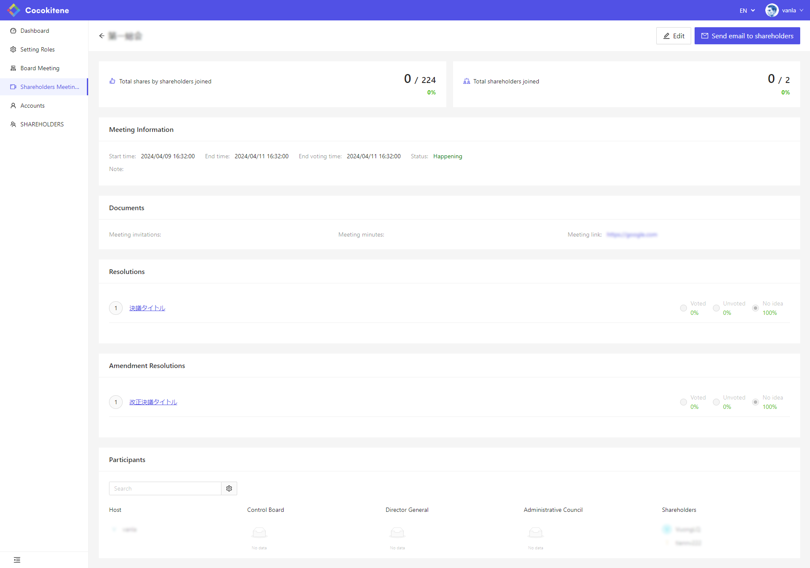
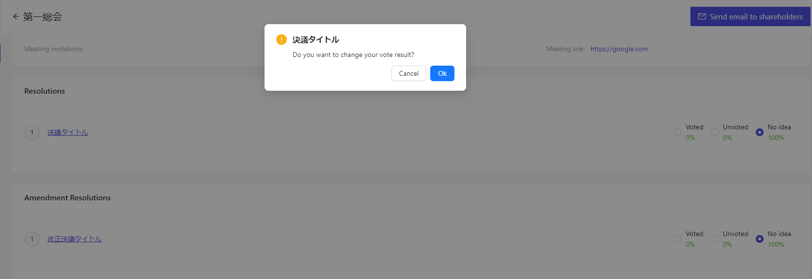
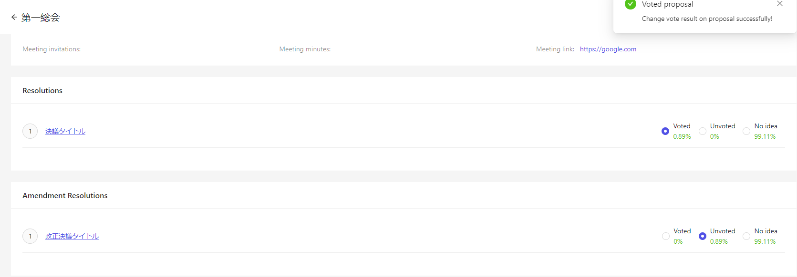
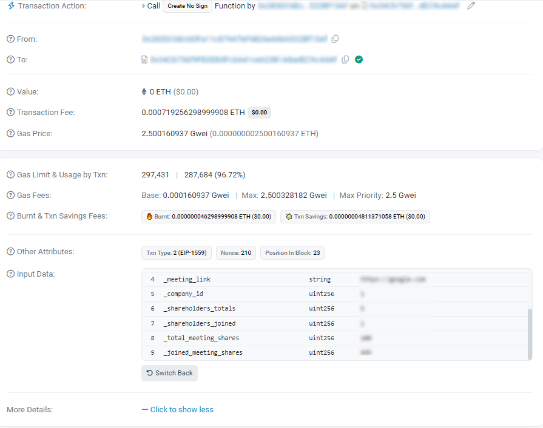

# Cocokitene のコンセプト

Cocokitene は、「ブロックチェーン技術を利用し、総会情報を効率的に保存」です。  
Cocokitene のシステムに、簡単に総会を行い、報告または投票もできます。

これは、画像を見て頂ければ、分かりやすいです。

総会作成

各議決を投票できます

総会情報をブロックチェインにプッシュし、保存する

このように、システム管理者が自由に設定を行うことによって、さまざまな総会をもたせることができます。  
可能性は無限大。
その他、Cocokitene で管理することによって、さまざまなメリットがあります。
