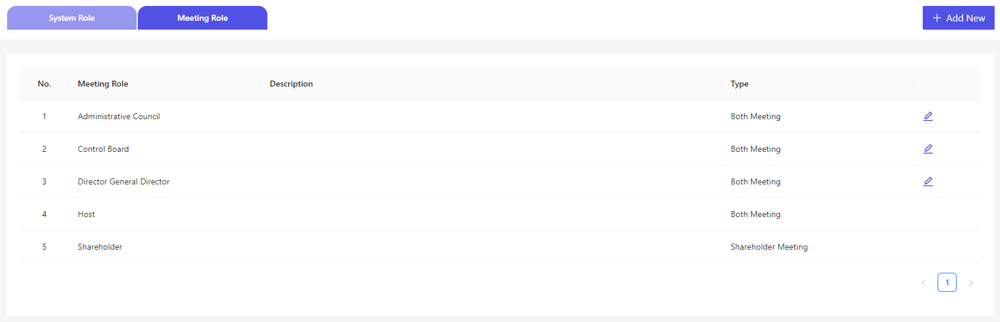

# 初期設定

最初のパーミッションを設定の手順になります。

## URL アクセス

Cocokitene ページにアクセスします。  
http(s)://(Cocokitene のサイト URL)/

## 初期設定画面

### システム役割

http(s)://(Cocokitene のサイト URL)/setting-role 
デフォルトスーパーアドミンが設定します。

  
「編集」ボタンを押下し、カスタムできて、各役割にそれぞれパーミッションをつけます。
パーミッションを選択することで、選択したパーミッションを設定され、権限が付与されます。

  
詳細は[こちら](/ja/permission)を確認してください。

### 会議役割
各会議の役割を設定します。
デフォルト役割が設定されていますけど、追加したい場合、「新規作成」ボタンを押下します。
  
詳細は[こちら](/ja/paticipant)を確認してください。

## 初期設定完了

必要事項を入力後、「保存」ボタンを押下することで、設定が保存され、Cocokitene が使用可能な状態になります。
