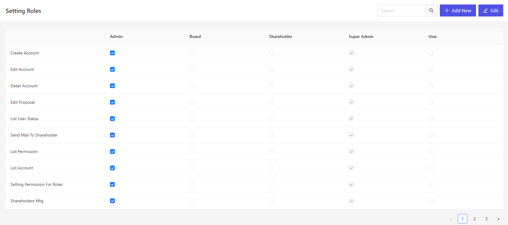

# 初期設定
最初の管理者ログインID設定など、初期設定の手順になります。

## URLアクセス
Cocokiteneページにアクセスします。  
http(s)://(あなたのサイトURL)/

## 初期設定画面
http(s)://(あなたのサイトURL)/setting-role

  
「編集」ボタンを押下し、役割にそれぞれパーミッションをつけます。
パーミッションを選択することで、選択したパーミッションを設定され、権限が付与されます。

  

## 初期設定完了
必要事項を入力後、「保存」ボタンを押下することで、設定が保存され、Cocokiteが使用可能な状態になります。

