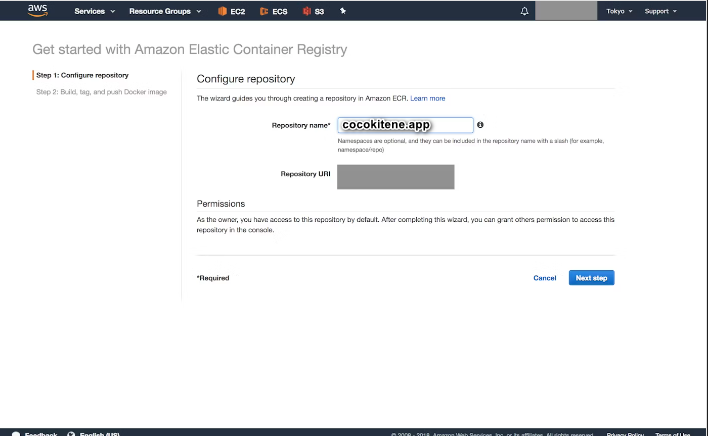
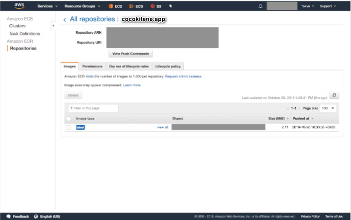
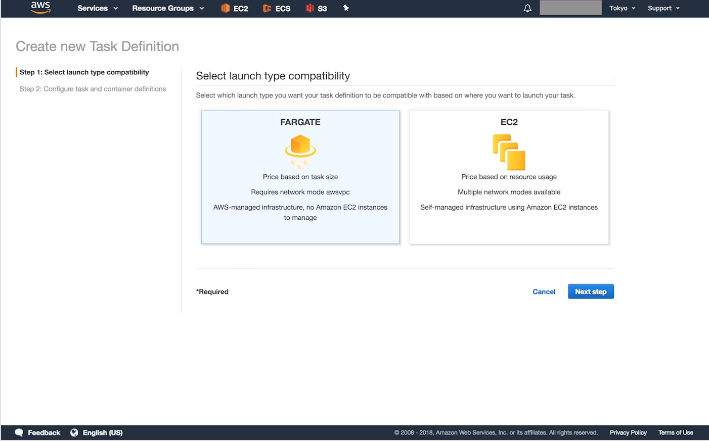
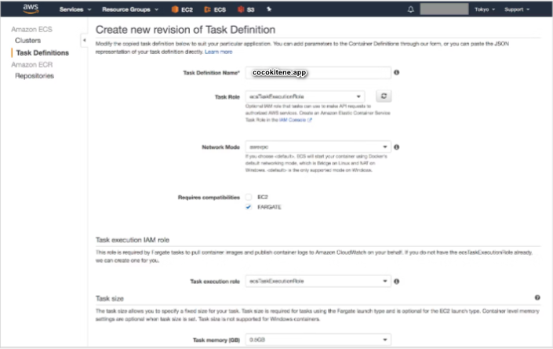
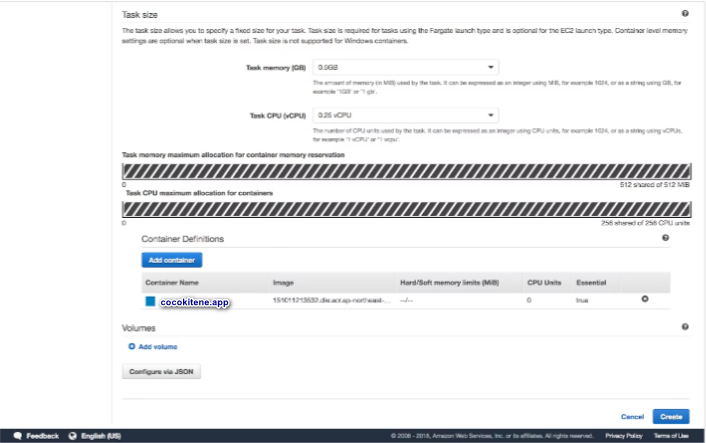
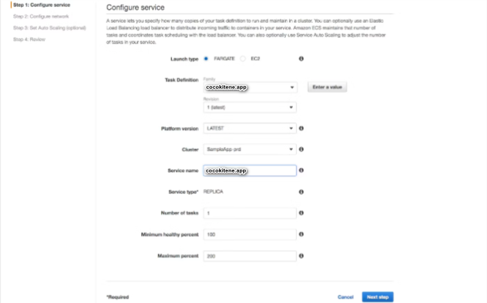
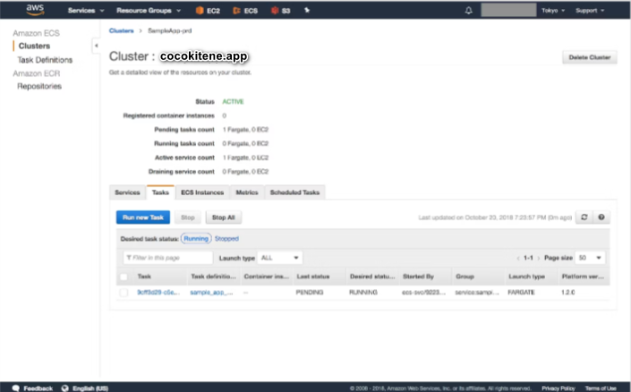

# AWSによるFargate構築
ECSで使うことができる、サーバレスでコンテナが実行できる技術であり、タスク(コンテナの実行単位)に割り当てたvCPUとメモリの量に応じて秒単位での課金でコンテナを実行できます。

### Clusterの構築
CocokiteneアプリケーションのPrd環境を作成したいので。まずは、Clusterを作成します。Fargateを指定して、RepositoryNameはcocokitene.appにします。
  

### ECRにDockerImageをpush
次に、ECRにDockerイメージをpushします。以下のコマンドをDockerfileの置かれているディレクトリで順番に実行します。

~~~
$(aws ecr get-login --no-include-email --region ap-northeast-1) \
&& docker build -t cocokitene.app . \
&& docker tag cocokitene.app:latest <YOUR ECR URL>/cocokitene.app:latest \
&& docker push <YOUR ECR URL>/cocokitene.app:latest
~~~

すると、以下のようにlatestというタグがついたイメージがpushされているのが確認できます。
  

### TaskDefinitionの構築
次にTaskDefinitionを構築します。まず、ローンチタイプでFargateを指定します。
  

次に、TaskDefinitionの名前、Roleの指定、Taskのサイズ（CPU/メモリの割り当て）、コンテナの定義をします。コンテナの定義では、コンテナ名と参照するイメージのURLを指定します。先ほどECRにpushしたので該当のURLをコピーしてきます。

最初の図のような構成にするためには、DSP/Datadog/Flumeそれぞれのイメージをpushした上で、3つのコンテナの定義を作成します。このGUIで設定した項目はJSONとして管理されます。JSONを直接構築してもいいのですが、GUIで項目ごとに指定するのが一番簡単です。
  
  

### Serviceの構築と実行
最後に、serviceを作成します。ローンチタイプでFargeteを指定した上で、先ほど作成したTaskDefinition名とそのリビジョンを指定します。その上で、taskの数や最大数・最低数、ロードバランサの定義、オートスケーリングのルールなどを指定していきます。

指定の内容からわかる通り、serviceがTaskDefinitionを元にtaskを作成・管理します。ロードバランサの管理も行うため、serviceを作成しないことには本番運用ができないとても大切な作業です。
  
serviceの作成が完了すると、設定したルールに従ってtaskが作成されているのが確認できます。statusがRUNNINGになっていることを確認してください。
  