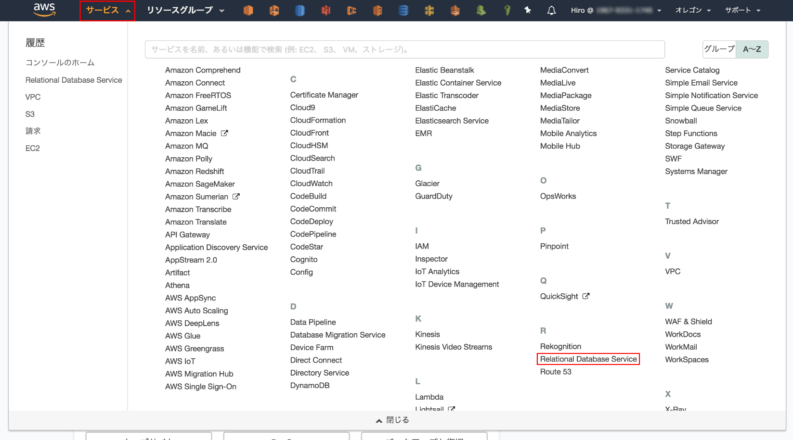
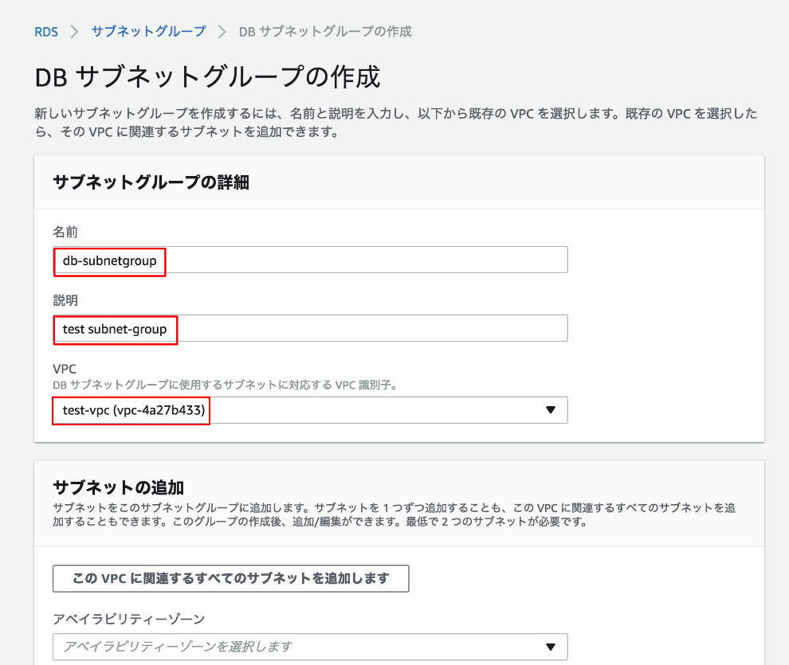
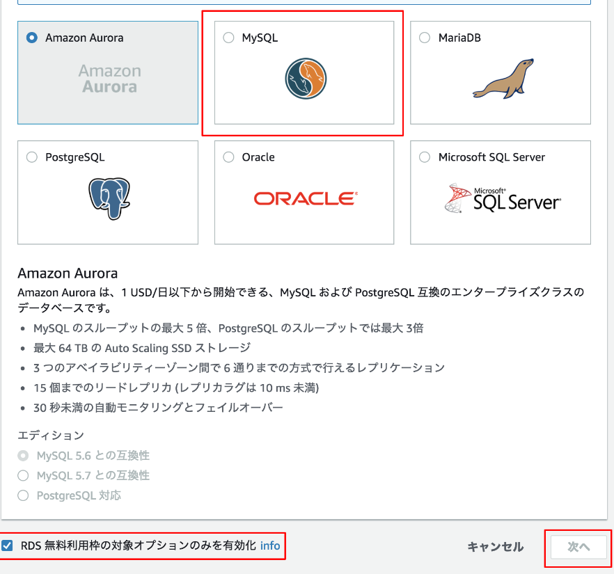
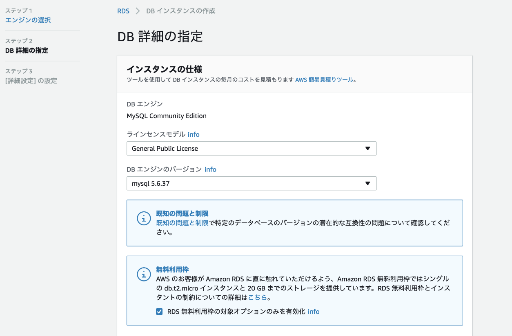
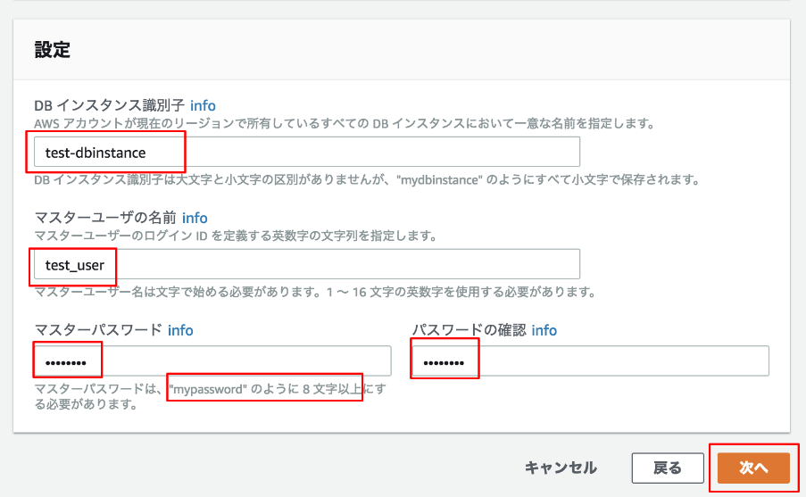

# AWSによるDB構築
本ページでは、DB構築する手順を記載します。  

### サブネットグループの作成です
画面左上の[サービス]から[Reltional Database Service]をクリックします。
  

### サブネットグループについての基本情報を記述します
  

### DBインスタンスを作成していきます
サイドバー[インスタンス]から、[DBインスタンスの起動]を選択します。
画面下部に[RDS無料利用枠の対象オプションのみを有効化]という項目をチェックし、[MySQL]を選択したら次に進みます。
  

詳細設定では、インスタンスのバージョンやクラスを選択できます。
~~~
RDSの無料利用枠は[20GB]なので、注意しましょう。
~~~
  

画面下部では、dbインスタンスに一意の命名をしたり、ユーザーやパスワードを設定します。

  

~~~
Tips:
[DBインスタンス識別子]は_(アンダースコア)が使えず、また[マスターユーザー]は-(ハイフン)が使えません。
注意しましょう。
~~~