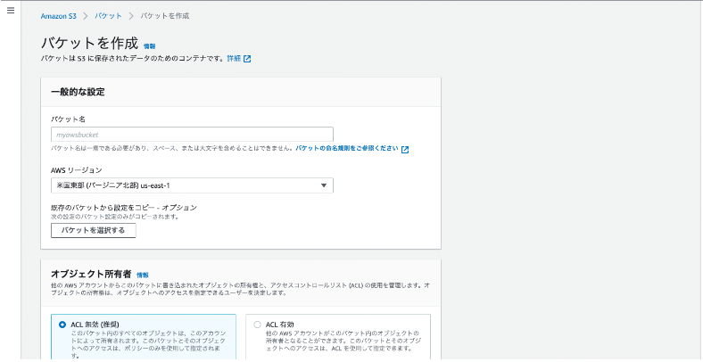

# AWSによるS3バケット構築
S3を利用する上で最初にやるべきことがバケットの作成です。 

### AWSのコンソール画面(AWS Management Console )にログイン
画面左上の[サービス]から[Reltional Database Service]をクリックします。
  

### 左上のサービスから「S3」を選択
すると「S3のコンソール画面(S3 Management Console)」に切り替わるのでそこから「バケットの作成」をクリックします。
  

### バケットの作成をクリック
作成時に「バケット名」や「リージョンの指定」、「アクセス範囲」などを設定できます。
バケット名は一意の名称をリージョンを自分の住んでいる場所に近いところを選択しておきます。
アクセス範囲はデフォルトで「パブリックアクセスをすべてブロック」にチェックが入っているのでそのままにすれば外部からのアクセスは全て遮断されるのでテスト作成時はこのままでOKです。後から変更もできるので必要な時に必要なアクセス権を付与するのが安全かもしれません。
  

その他の設定はいじらずそのまま「バケットの作成」をクリック、緑色のメッセージが表示されていれば作成は完了です。
  

### オブジェクトの手動アップロード
続いて試しに適当なオブジェクト(画像ファイルなど)をバケット内にアップロードする方法をみていきます。

S3のコンソール画面からオブジェクトを追加したい「バケット名」を選択します。その中の「アップロード」をクリック。
  

「ファイルを追加」ボタンを押すとパソコン内からデータを選んでアップロードすることができます。
  

緑色で正常にアップロードされた通知が表示されれば成功です。
 