# ログイン設定
Cocokiteneにログインを行う時の、各種ログイン設定を行います。

## システムログイン方法
- システム管理者が、以下のURLを入力します。  
http(s)://(CocokiteneのURL)/login  
※上記で記載の「システム設定変更」を行うことで、アクセスが出来るようになります。

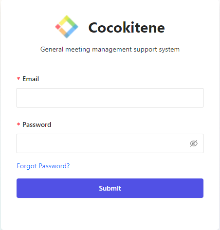

## ユーザーログイン方法

### Eメールでログイン
- 一般的なユーザーが、以下のURLを入力します。  
http(s)://(CocokiteneのURL) 
※ユーザーはログイン方法が２つあり、Eメール・パスワードそれともウォレットアドレスです。 
※上記で記載の「システム設定変更」を行うことで、アクセスが出来るようになります。

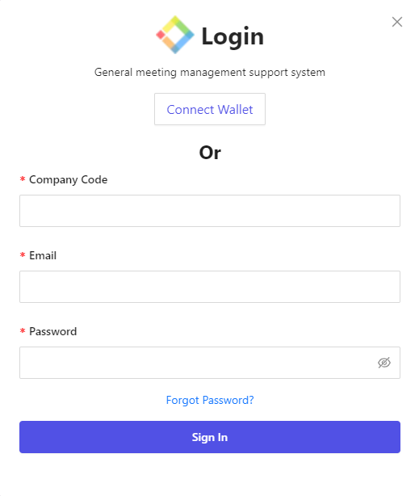

#### パスワード設定
ログインパスワードに関連するルールを設定します。   

##### 複雑なパスワード
- 設定がYESの場合、3種類以上の文字種（半角英大文字、半角英小文字、半角数字、半角記号）を含んだ８文字以上のパスワードを設定する必要があります。
- 初期値はなしです。

##### 初回ログイン時にパスワードを変更させる
- ユーザーがはじめてログインを行った際に、パスワードを変更させる画面を表示します。
- この設定をYESにした後で、新規登録、またはパスワードをリセットしたユーザーに対し、有効になります。
- この設定をYESにする前に新規登録などを行ったユーザーには、設定が反映されません。
- 初期値は「NO」です。

##### 注意

- 「複雑なパスワード」は、ユーザー設定画面やパスワードのリセット画面などでユーザー自身がパスワードを設定する場合に適用されます。システム管理者が設定する場合は対象外です。

- 既定の動作では、ログイン状態でブラウザを閉じた場合でも、一定時間（120分）経過するまでは、ログイン状態を維持します。  
v3.6.0以降で、ログイン状態でブラウザを閉じた場合に、自動的にログアウトにする場合には、「.env」ファイルを開き、以下のように追記を行ってください。  
※設定ファイルの編集方法について、詳細は[こちら](/ja/config)をご参照ください。

### パスワードリセット流れ
パスワードリセットは「パスワードをお忘れ」のURLで設定します

- システム管理者のURL：

~~~
http(s)://(CocokiteneのURL)/forgot-password
~~~

- ユーザーのURL：

~~~
http(s)://(CocokiteneのURL)/forgot-password-user
~~~

##### 引数：システム・ユーザー流れ

Eメール正しい場合：

対象のユーザーのEメールアドレスです。
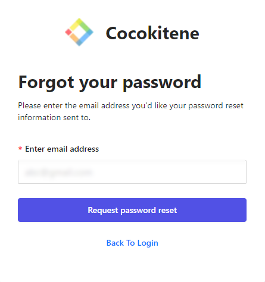

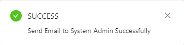

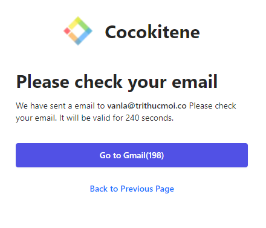

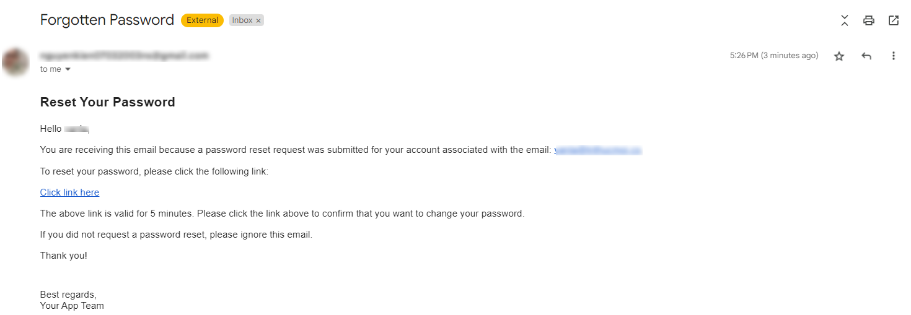

- #### パスワード
変更対象のユーザーのパスワードです。

- #### パスワード確認
入力したパスワードを改めて入力します。
※入力した新しいパスワードが一致しなければならないです。

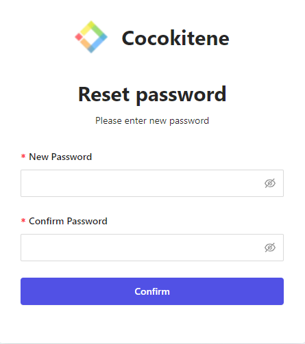

Eメール正しくない場合：

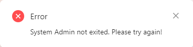

### ウォレットアドレスでログイン
前提：ユーザーのウォレットアドレスがシステムに登録されている。

- ##### MetaMaskログイン
ネットが4つあります。
現在、使用されているネットは「MetaMask」です。
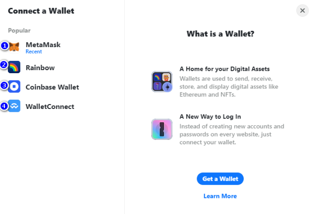

「MetaMask」パスワードを入力します。
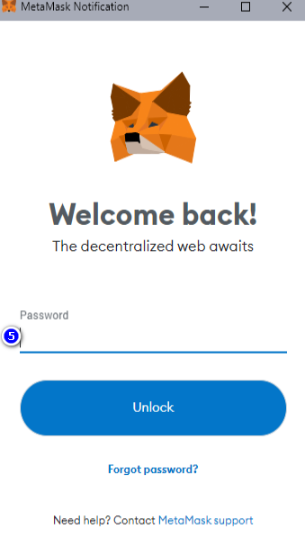

- ##### dAppのほうにサイン
dAppと接続できるように、「Connect Wallet」ボタンを押下します。

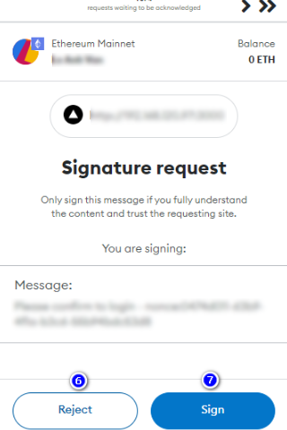

- ##### サインした後状況
ランディングページにて、「ネット変更」ボタンがあり、こちらを押下すると、ネット一覧が表示され、ネット変更できます。
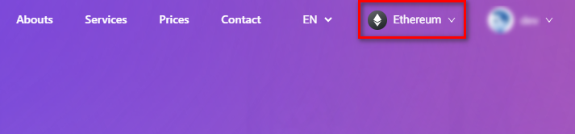

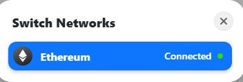