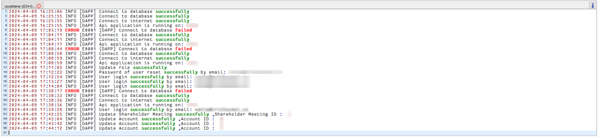

# ログ
Cocokiteneの各種ログについて記載します。

## ログ種類
現在Cocokiteneでは、以下のログ種類があります。

- **操作ログ**  
各ユーザーが画面で操作した内容を、記録します。

- **ブロックチェインログ**  
ブロックチェーン上の各取引やイベントのタイムスタンプに関する情報を提供します。

- **ログファイル出力**  
主にエラーが発生した場合に、サーバー上にログファイルを出力します。  

## 操作ログ  
各ユーザーが画面で操作した内容を、記録します。
操作した内容とは、主に以下があります。  

- ユーザーが画面を表示、データを新規追加、更新、削除など
- APIの認証、実行
- システムログ

### 確認方法
- システム管理者が、該当箇所に保存されます。

- ログは日付ごとに分類されます。

## ログファイル出力  
主にエラーが発生した場合に、サーバー上にログファイルを出力します。  
※後述の設定を追加することによって、エラー以外の値を出力こともできます。

### 確認方法
- Cocokiteneを構築しているサーバーで、以下のパスにアクセスします。  
(Cocokiteneのルートフォルダ)/logs  
