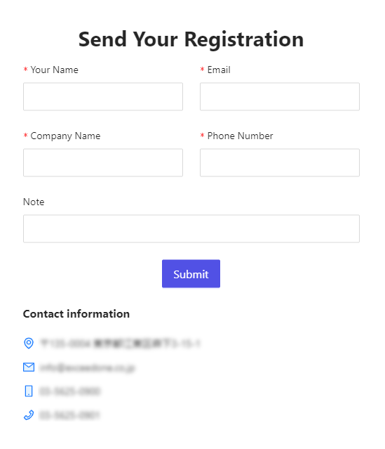
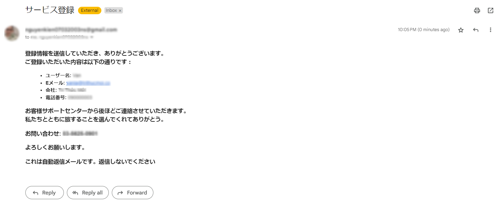
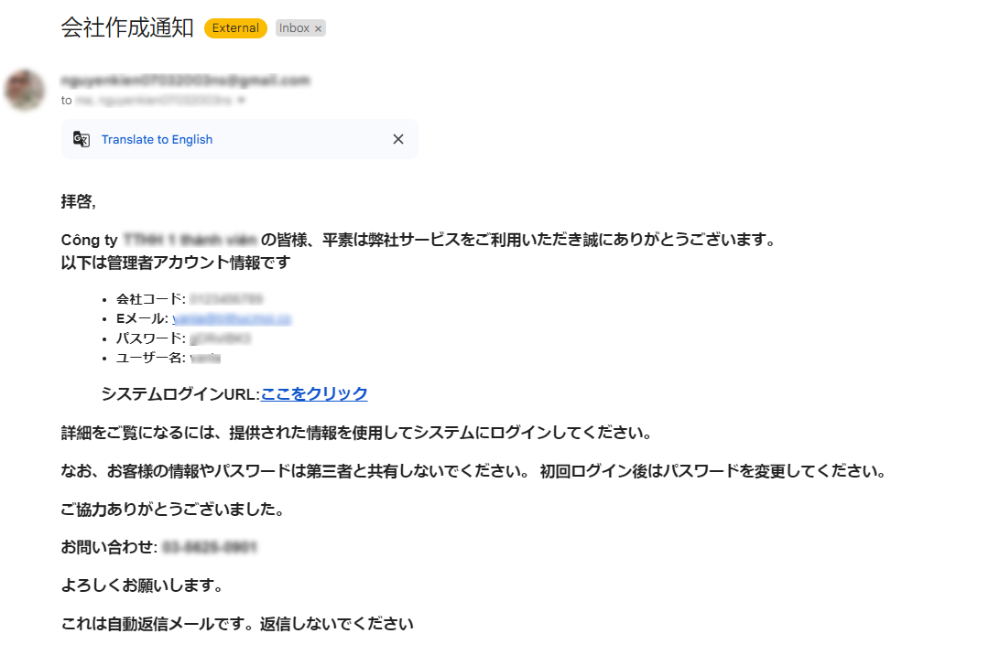
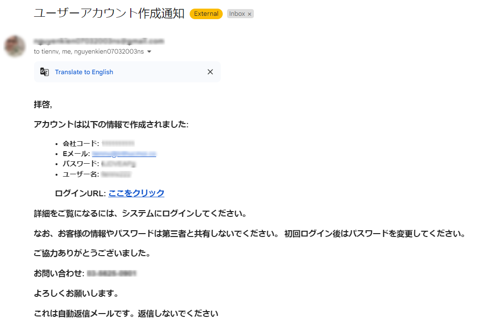
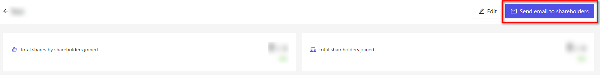
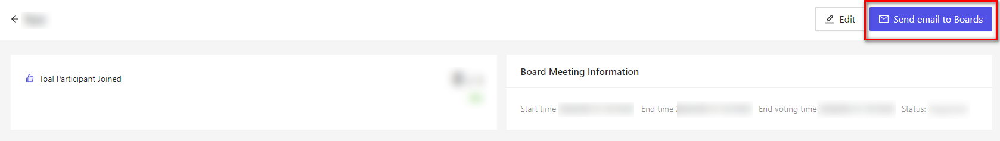
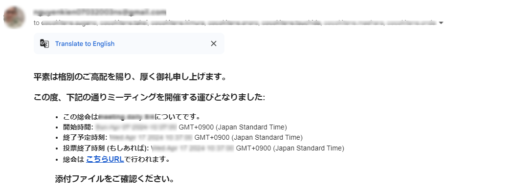

# メール通知テンプレート
システムからメールを送付する時の、メールの件名、本文などを設定します。  

## ランディングページからサービス登録
サービス登録のフォーム：

必須項目を入力し、「登録」ボタンを押下します。
サービス登録メールが自動送信されます。

## 新規会社作成
システムに新規会社を作成したときのメール

## 新規アカウント作成
システムに新規アカウントを作成したときのメール

## 株主・取締役総会の招待書
株主総会にて、「株主にメール送信」ボタンを押下します。

取締役総会にて、「役員にメール送信」ボタンを押下します。

株主・役員のメールに総会情報のメールが送信されます。

