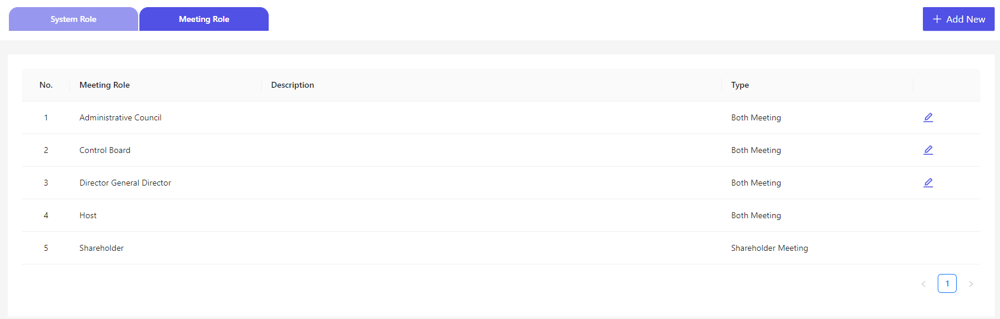
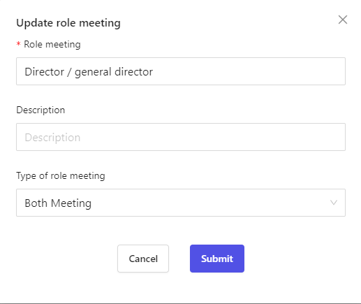
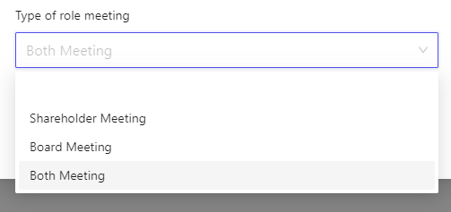
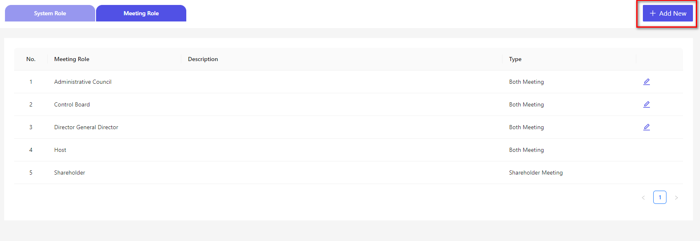
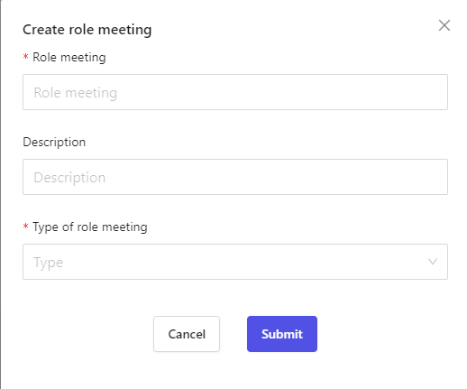

# 役割・権限の概要
Cocokiteneにおける、参加者の概要についてご説明します。  
これはCocokiteneにおいて、２つ総会があります。
それぞれの総会には異なる参加役割があります。

# 設定画面
こちらでは、基本的な役割が設定されています。

  

~~~
「Host」「株主」の役割は固定で設定れさ、編集できかねます。
~~~

### Host
どの総会でも、情報の管理や編集を行う人が必要のため、「Host」役割は両方ともあります。

現時点、「Host」役割は、システム管理者の役割を持つアカウントを取得します。

### 株主
株主会議では、株主が参加する必要があるため、株主の役割は編集や削除ができないものとなります。

## 留意点 
※同じ役割であっても、それぞれのミーティングタイプによって参加権限が異なるため、参加者の数やユーザーの権限も異なることがあります。　　

## 役割画面操作
役割を追加したり、削除したりしたい場合、当役割の「編集」ボタンを押下して、編集できます。

### 役割編集
 

「総会種類」のところに、４つ選択肢があります。 
 

-  空白：総会から抜けます
-  株主総会：株主総会に適用します
-  取締役総会：取締役総会に適用します
-  両方とも：株主・取締役総会に適用します
~~~

総会役割を設定した後、総会の各画面に反映できます。

### 役割追加
新規な役割を追加したい場合、「新規追加」ボタンを押下します。
 
 

「役割名」「役割種類」は必須項目で、異なる目的に応じて、入力します。

