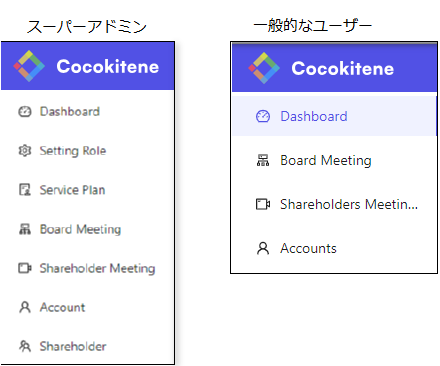

# 役割・権限の概要
Cocokiteneにおける、役割・権限の概要についてご説明します。  
これはCocokiteneにおいて、特定のデータやページや機能を、指定のユーザーのみがアクション(操作)できるようにするために、重要な考え方です。  

新規にユーザーを追加し、そのユーザーがログインを行った場合、初期設定では、ほとんどの機能を使用できません。  
スーパーアドミンは、新規追加したユーザーに対し、適切に役割・権限を設定する必要があります。  

##### ■権限があるメニューのみ表示される
→ログインユーザーのメニューには、権限のある項目のみが表示されます。  

##### ■アクセスエラーになる  
→権限がないページを表示しようとした場合、アクセスエラーになります。

##### ■機能ボタンが表示されない  
→対象の役割がなければ、機能ボタンが表示されません。  

## 権限の管理単位
Cocokiteneでの権限管理の単位は、主に以下の2つになります。

- システム全体
- テナント単位

### 全体図

### (1)システム全体

Cocokiteneでは、組織を階層管理することができます。 

Cocokiteneのシステム設定を操作する権限となります。  
システムで設定する権限の例として、以下のようなアクションがあります。  

- サイト名を変更する。
- テナントログインユーザーを管理する。
- 全サービスプランの作成・編集・閲覧などを行う。

#### 権限設定方法

##### システムアドイン
「システムアドミン」はシステムのすべての操作を実行できます。

##### 全ユーザー一括設定
組織などに関わらず、各役割にパーミッションを付与できます。

「編集」ボタンを押下し、それぞれパーミッションをチェックできるようになります。

#### 別組織のユーザー・組織情報の取得範囲について
Cocokiteneを、社内ポータルサイトのような用途で使用する場合、「システム内で、どのユーザーが使用しているか」「どの組織・どの会社がシステム登録しているか」ということは、大きな問題にはなりません。

ですが、Cocokiteneを社外のユーザーに払い出して利用してもらうことを想定した場合、他社間でユーザー情報を取得・閲覧できることは、問題となる場合があります。

  
[こちら](/ja/multiuser)の設定を行うことで、他社間でのユーザー情報の取得・閲覧を制限することができるようになります。