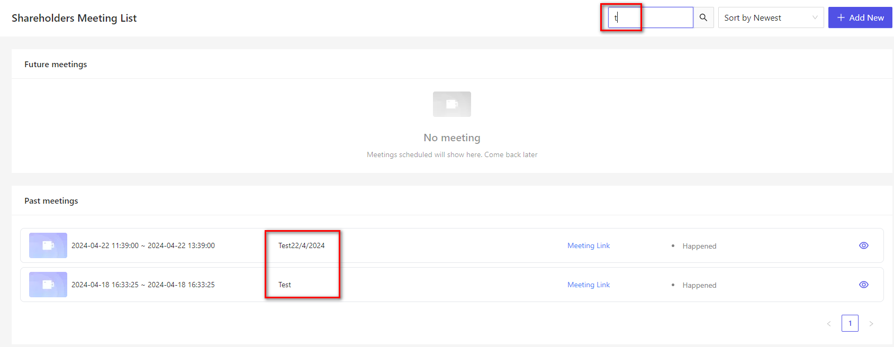

# 検索
ページ上部の検索バーによる検索と、データ一覧画面の検索についての説明になります。

## 検索バーによる検索（フリーワード検索）
各ページの上部には、検索バーが表示されています。  
  
この検索バーに単語を入力することで、Cocokiteneに登録しているデータを検索することができます。  

### キーワード検索
通常の検索です。入力したキーワードを含む（部分一致）データが結果に表示されます。  
  

- 検索対象は、ユーザーが閲覧することができる権限のある機能のみです。  

検索バーにキーワードを入力し、検索が実行されます。  
検索対象となるデータ一覧が最初に表示され、その後合致するデータを検索します。

検索結果データには、［表示］［編集］というアイコンが表示されます。  

## データ一覧画面の検索
データ一覧画面にて、検索を行うことができます。
データ一覧画面では、画面の検索バーによる検索と、該当データが表示されます。

### 画面の検索バーによる検索

#### システム側
- 会社一覧画面：会社名で検索
- サービスプラン一覧画面：サービスプラン名で検索

#### ユーザー側
- 株主・取締役総会一覧画面：総会名で検索
- アカウント・株主一覧画面：総会名またはEメールで検索
- 役割設定画面：パーアドミンで検索

