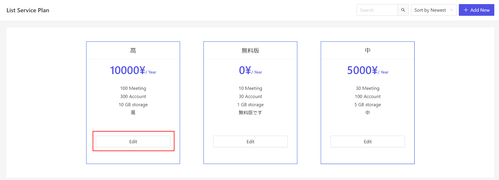
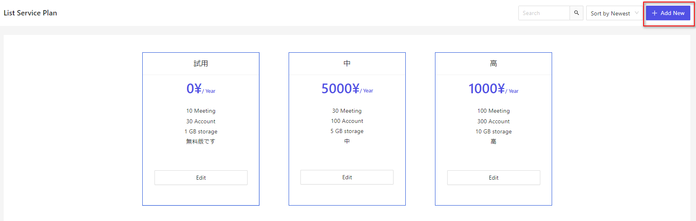

# サービスの概要
Cocokiteneにおける、サービスの概要についてご説明します。  
これはCocokiteneにおいて、ビジネスが自社のモデルやニーズに適したサービスプランに登録できるように、サービスプランを管理します。 

## サービスプラン登録の流れ
1. 企業は「ランディングページ」からサービス登録
2. システム側は情報を受け取り、ビジネスとサービスに関して連絡を取ります
3. 企業情報を作成し、サービスプランに登録します。

## サービスプラン
サーバープランを管理するためには、以下URLでシステムアカウントでシステムにログインする必要があります。
http://（CocokiteneURL）/login 

### サービスプラン一覧
現時点、システム上で3つプランをデフォルトで設定します。

### プラン編集画面
プランを変更したい場合、該当編集ボタンを押下します。

株主アカウント数・総会数・保存容量を設定できます。 

### 新規プラン追加
プランを追加したい場合、「新規追加」ボタンを押下します。

必須な項目を入力し、「保存」ボタンを押下すると、新規なプランが生成できます。

