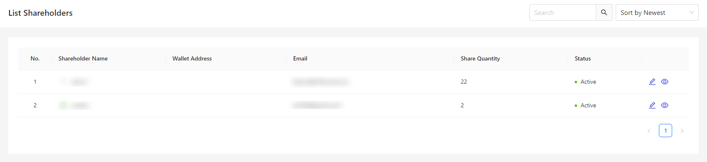
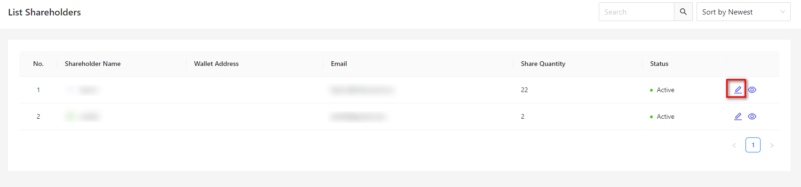
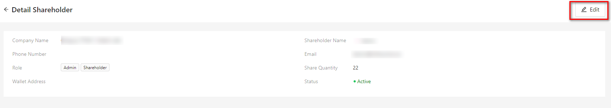
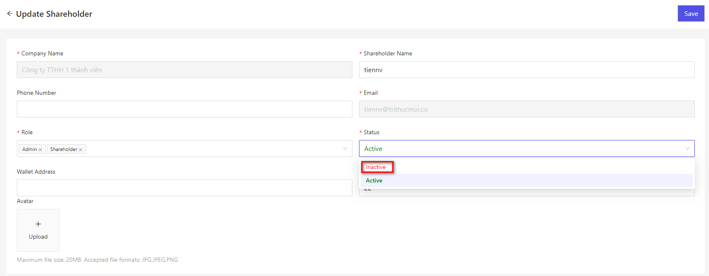

# 株主

このシステムを使用する株主管理を行います。

## 名称定義

### 株主

株式会社の株式を保有する者のことです。 
株主は、取締役の選任・解任を含めて、会社に関する重要な事項を決定する権利を持っています。 
そのため、株主は株式会社の「所有者」と表現されることもあります。 
さらに株主は、会社の得た利益の分配を受ける権利や、会社清算時に残った財産の分配を受ける権利などを有します。 

### ログインユーザー
このシステムでは、株主は一般的なユーザーであり、2つの方法でログインすることができます。 
Eメール/パスワードまたはシステム内でウォレットアドレスを登録している場合は、ウォレットアドレスを使用してログインできます。

詳細は[こちら](/ja/user)で参照してください。

## 株主管理

株主情報を管理する方法について記載します。

### 一覧画面表示

左メニューより、「株主」を押下します。  
もしくは、以下の URL にアクセスしてください。  
これにより、ログインユーザー設定画面が表示されます。 
http(s)://(Cocokitene の URL)/shareholder  
現在システムで登録されているユーザーの一覧が表示されます。

※株主画面では、新規追加機能がないです。
新規株主を追加したい場合、アカウント役割に「株主」を入れていただきます。

### 保存

設定を記入したら、［保存］を押下してください。

### 編集

ユーザーの編集を行いたい場合
- ユーザー一覧にて、該当する行の［編集］リンクをクリックしてください。  

- ユーザーの詳細画面にて、「編集」ボタンを押下してください。

### 活動停止

ユーザーの活動停止を行いたい場合、ユーザーのステータスを「非アクティブ」選択してください。  
「非アクティブ」になった後、アカウントはログインできなくなります。

