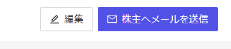
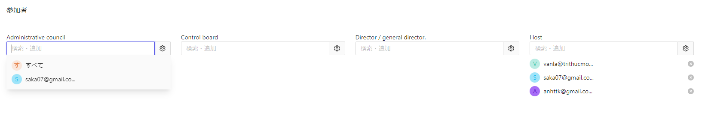

# 株主総会の概要
Cocokiteneにおける、株主総会についてご説明します。  
これはCocokiteneにおいて、総会情報を効率的に行います。

株主総会にて、色んな機能を利用できます。

## 株主に招待メール送信
「株主にメールを送信」ボタンを押下すると、メールは自動に送信します。

メールのイメージは[こちら](/ja/mail)をご覧ください。

## ファイル添付
改正決議・決議・総会事録・総会集合を追跡するために、画面上に表示される情報に加えて、ファイルの追加機能もあります。
これらのファイルの最大容量は20MBであり、docx、excel、pdfの形式を受け付けます。

> 改正決議・決議の場合、タイトルや詳細などの情報を入力する必要があり、その後に「ファイルを追加」ボタンが表示されます。

## 投票
株主総会では、「株式数」で決まります。
詳細は[こちら](/ja/vote)をご覧ください。

## 参加者を追加・検索
一番下に参加者を追加・検索することができます。
入力したキーワードを含む（部分一致）データが結果に表示されます。
一人が複数の役割を持つことができ、総会に参加する際に、複数の立場で招待できます。

