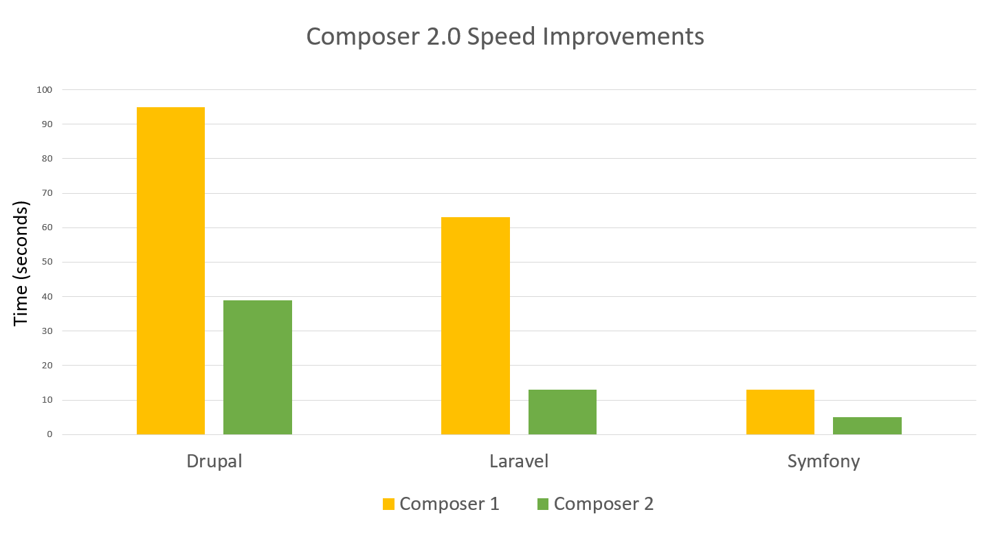

# composer更新
composerのアップデートを行うための手順です。  

> 万が一、本アップデート実行により、Exmentの更新時にエラーが発生するようになった場合は、[こちら](https://github.com/exceedone/exment/issues/849)にご報告いただけると、非常に幸いです。  


2020/10に、composerのver2がリリースされました。  
composerは、Exmentのインストール・アップデートで利用しているライブラリです。  
  
ver2では、以下の対応が実施されています。

- 速度とメモリ使用量の両方の点で大幅な改善
- require/remove および部分的な更新がはるかに高速



引用：  
https://blog.packagist.com/composer-2-0-is-now-available  
https://qiita.com/ucan-lab/items/289009ffe5bb417c808e  

Exmentでも、composer2でのインストール・アップデートを検証し、問題なく実施できることを確認しております。  
環境にもよりますが、composer1の時に頻発していた、メモリ使用量過多の改善が期待できるので、composer2へのアップデートを推奨しております。  


## アップデート手順
composer2にアップデートするには、いくつかの手順が必要です。  
<span class="red">※可能な限り、開発環境などで同手順を実施して検証してから、本番環境で実施していただきますよう、お願いします。</span>

### 現在のcomposerバージョンの確認

- 現在のcomposerバージョンを、以下のコマンドで実施します。(どのフォルダで実施しても、特に問題ありません)

```
composer --version
```

- 上記のコマンドの結果が、すでにcomposer2.X.Xになっており、かつExmentのアップデートが、特に問題なく正常に実行完了出来ている場合は、すでにcomposerのアップデートが完了しているので、これ以降の手順は不要です。

- composer1.X.Xになっている場合は、これ以降の手順を実施してください。

### 現在のlaravel/frameworkのバージョンの確認、アップデート

Exmentで使用している、laravel/frameworkのバージョンを確認します。  
※同サーバーで複数のExmentがインストールされている場合、すべてのExmentに対して、以下の手順を実施してください。  

- 以下のコマンドを、Exmentのルートフォルダで実施します。

```
php artisan --version
# 以下のような結果が表示されます
# Laravel Framework 5.6.39
```

- 上記の結果が、version5.6.40以上の場合は、特に何もする必要がありません。

- 上記の結果が、version5.6.40未満の場合は、以下のコマンドで、プロジェクト全体のアップデートを行います。  

```
composer update
```

### composerアップデート

- 現在のcomposerバージョンを、2.X.Xにアップデートします。

```
# 以下のいずれかを実施してください
composer self-update -–2
composer selfupdate -–2
```

- アップデート後、なんらかの不具合が発生してしまった場合、以下のコマンドで、version1.X.Xにロールバックできます。  
ただし、下記のコマンドは、**Exmentのフォルダ以外のパス**で実行をしてください。Exmentのフォルダ内で実行すると、エラーになるようです。

```
composer self-update -–1
composer selfupdate -–1
```
