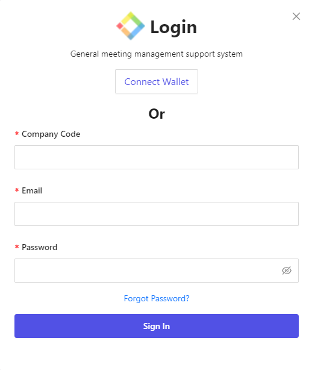
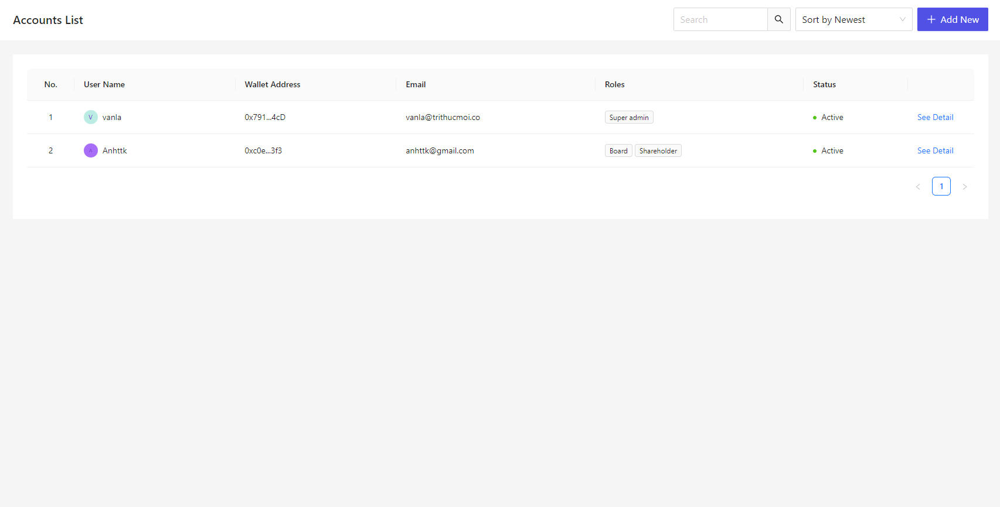
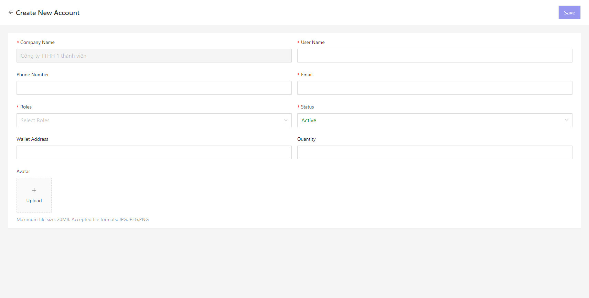
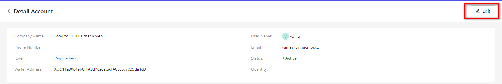
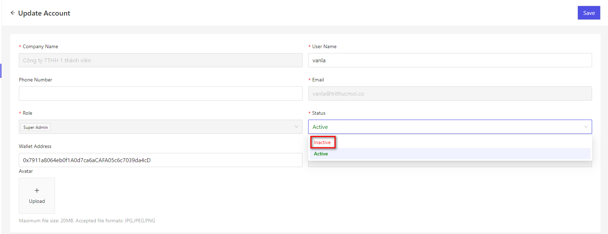
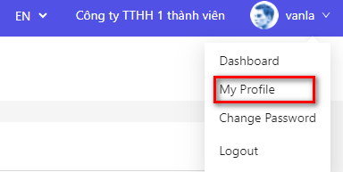
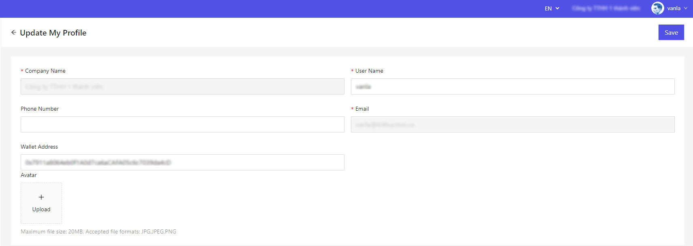

# ユーザー・ログインユーザー

このシステムを使用するユーザー、またはログインユーザーの管理を行います。

## 名称定義

### ユーザー

自社や組織に所属する社員や、人物です。  
このシステムを使用しない方も、ユーザーとして追加することができます。  
E メールアドレスが必須になります。  
他のテーブルとの関連付けなどで、ユーザーを紐付けて登録することはできますが、システムにログインすることは出来ません。

### ログインユーザー

ユーザーのうち、Cocokitene にログインすることができる社員・人物です。  
ユーザー情報にパスワードが割り振られますので、Cocokitene のログイン画面からログインすることができるようになり、データの登録や参照などを行うことができます。

#### ユーザー、ログインユーザーの設定手順

Cocokitene にログイン出来るようになるまでの流れは、上記のような手順となります。  
① ユーザー管理画面で、ユーザーのユーザー名、メールアドレス、役割を登録します。  
その後、① で登録したユーザーのパスワード、会社コードはユーザーのメールに自動的に送信します。
これで、登録したユーザーが Cocokitene にログイン出来るようになります。

> ログイン時、初回ログイン後はパスワードを変更してください。

## ユーザー管理

全ユーザー情報を管理する方法について記載します。

### 一覧画面表示

左メニューより、「アカウント」をクリックします。  
もしくは、以下の URL にアクセスしてください。  
これにより、ログインユーザー設定画面が表示されます。 
http(s)://(Cocokitene の URL)/account  
現在システムで登録されているユーザーの一覧が表示されます。

### ユーザーの新規追加

- 「ユーザー」の一覧画面で、ページ右上の［新規作成］ボタンをクリックします。

- 新規追加画面が表示されますので、必要事項を入力します。
  

#### ログイン設定

ログイン権限付与を YES にすることにより、ログインユーザーとしてユーザーを作成することができます。
設定方法は下記の[ログインユーザー管理](#ログインユーザー管理)をご参照ください。

### 保存

設定を記入したら、［保存］をクリックしてください。

### 編集

ユーザーの編集を行いたい場合
① ユーザー一覧にて、該当する行の［編集］リンクをクリックしてください。  

② ユーザーの詳細画面にて、「編集」ボタンを押下してください。

### 活動停止

ユーザーの活動停止を行いたい場合、ユーザーのステータスを「非アクティブ」選択してください。  
「非アクティブ」になった後、アカウントはログインできなくなります。

#### パスワードを自動生成する

アカウント追加時にパスワードを自動生成します。  
自動生成後、該当するメールアドレスに、パスワードメールが自動送信されます。  
\*\*※この機能を実行する場合、[メール設定](/ja/system_setting#システムメール設定)を行う必要があります。
NO の場合、パスワードを入力する為のテキストボックスと「ユーザー情報をメール送信する」項目が表示されます。

#### ユーザー情報をメール送信する

「パスワードを自動生成する」が NO の場合に表示されます。  
該当するメールアドレスに、パスワードメールが送信されます。  
**※この機能を実行する場合、[メール設定](/ja/system_setting#システムメール設定)を行う必要があります。**

#### 初回ログイン時にパスワードを変更させる

ユーザーがはじめてログインを行った際に、パスワードを変更させる画面を表示します。  
新規登録、またはパスワードをリセットしたユーザーに対し、有効になります。

#### ユーザー情報登録

あらかじめ、ログイン情報を付与したいユーザー情報を、[ユーザー管理](#ユーザー管理)画面で追加してください。

#### マイプロフィール画面における閲覧・編集

Cocokitene の画面右上にあるログインユーザー名の表示をクリックした後、［設定］をクリックします。  

ログインユーザーが表示可能となっている各種情報が表示されます。  
入力可能となっている列は本人が編集して保存することができます。

「ユーザー名」「電話番号」「ウォレットアドレス」「アバター」を編集可能としています。
