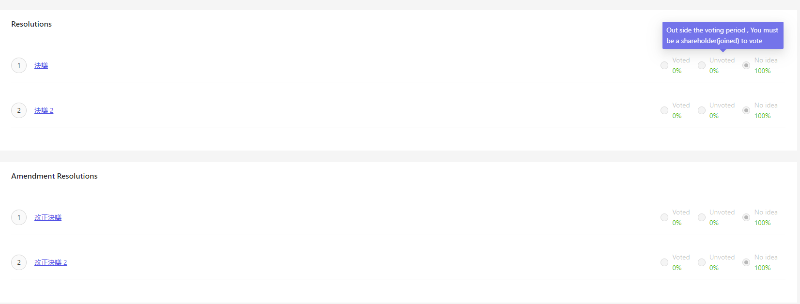

# 投票
Cocokiteneに行う総会にて、議決また選挙を投票することが可能です。
 

## 株主総会
総会詳細画面にて、議決また改正決議の投票は「株式数」で決まります。
この画面では、株式を投票に使用します。
各株主は一定数量の株式を保有し、株式の数量を使用して会社内の投票および決定に参加します。

~~~
注意：株主が会議に招待される時点での株式の数量が使用されます。
~~~

### 投票条件
投票するためには、以下の条件3つの条件を組み合わせる必要があります。
- 参加しています
- 総会にて、役割は「株主」である
- 投票期間中

## 取締役総会
総会詳細画面にて、議決また改正決議以外は、「選挙」機能もあります。
この画面では、参加者は一人毎に、1票として投票また選挙します。

### 投票条件
投票するためには、以下の条件3つの条件を組み合わせる必要があります。
- 参加しています
- 総会にて、「ホスト」以外である
- 投票期間中

