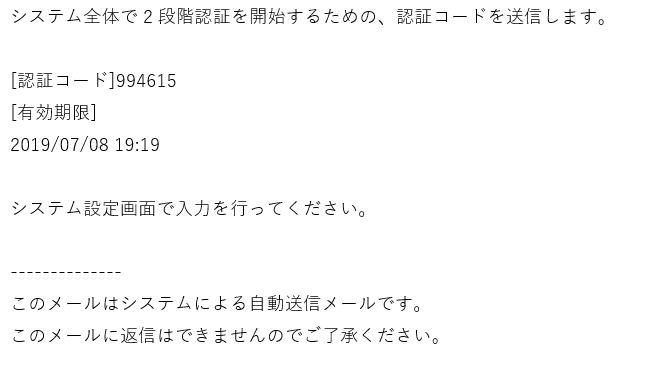

# Two-factor authentication system settings
Exment supports two-step verification.  
This section describes how to configure Exment on the system administration side.  

## Two-factor authentication method
Currently, the following two-step authentication methods are supported.  

- E-mail: After logging in with your ID / password, an e-mail with the authentication code will be sent to the registered e-mail address.  
Enter the verification code in the form to complete the login.  

- Google Authenticator: After login with ID / Password, two-factor authentication is performed using Google Authenticator.  

## Assumptions
- Two-step authentication in Exment is not set by individual login users, but is set by the entire system.  
For example, if the two-step authentication method is selected as "Google authentication system", all users will perform two-step authentication using the Google authentication system.  

- When performing two-factor authentication with Exment, it is essential that the system be able to send e-mail.  
This is the same even when the type of two-step verification is set to "Google Authenticator".  

- If you set two-step authentication and set the authentication method to "Google Authenticator", when the user logs in for the first time, the e-mail for registering Google Authenticator to the registered e-mail address Send.    
  
By clicking the link of the sent e-mail address, each user can set up 2-step verification.  
By performing the setting once, the initial setting will not be performed for the second and subsequent times, and it will be a method that only inputs the authentication code from the Google authentication system.  

## Setting method
This is how to set up two-factor authentication.

- Execute the following command from the root folder of the project.  

~~~
composer remove pragmarx/google2fa
composer remove  simplesoftwareio/simple-qrcode=^2.0.0
~~~

- Open the ".env" file from the root folder of the project, and add as follows.  
※ how to edit the configuration file, for more information click [here](/config) Please refer to.

~~~
EXMENT_LOGIN_USE_2FACTOR=true
~~~

- It will transition to the system setting screen with the administrator account.  

- First, configure the email settings. Enter the settings for sending email. See [System Mail Settings](/system_setting#System-mail-settings) for details.  
After completing the settings, click “Submit” once to save.  

- After that, "2 step authentication" is displayed at the bottom of the system setting screen.  
  

- Set the "Use two-factor authentication" item to "YES".  
By setting to YES, the remaining setting items will be displayed.  
  

- In the "Default authentication method" item, select "Email" or "Google Authenticator" for the method used for two-step authentication.  

- Click the "Send Authentication Code" button to send an authentication code to use the two-step verification to the currently logged in account.  
Enter the authentication code in the sent e-mail in the "Authentication code" field.  
  
  

※When clicking the "Send Authentication Code" button, an error like the image below may occur.  
This error occurs when updating from a version lower than v1.4.0.  
In that case, follow [these steps](/update/v1_4) to import the email template.  
  

※In addition, an error like the image below may occur.  
Occurs when the e-mail transmission settings are not performed properly. In that case, make the correct settings according to the [system mail settings](/system_setting#System-mail-settings).  
  

- Then click "Send" to save the settings.

## Disable setting
If you want to forcibly disable 2-step verification for any reason, please do the following settings.

- Open the ".env" file from the project folder and add as follows.  
※ how to edit the configuration file, for more information [click here](/config) Please refer to.  

~~~
EXMENT_LOGIN_USE_2FACTOR=false
~~~

By performing this setting, even if you set "Use two-factor authentication" on the screen, two-factor authentication will be disabled.