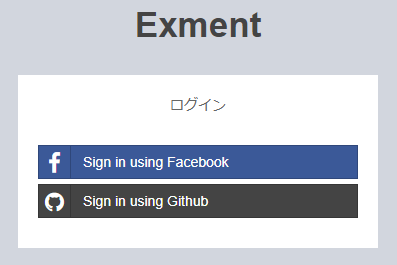

# Login settings (SSO)
Make various login settings when logging in to Exment.  
This page specifically covers single sign-on (SSO).  

## Login method
In addition to the standard login method, Exment offers various login methods.  
The login method is described below.  

### Standard
This is a method of registering a user in the database created by Exment, setting a password, and logging in in cooperation with the Exment database.

### OAuth
It is a method to log in with single sign-on in OAuth format.  
When you click the login button, you will be redirected to the login screen of the provider you registered in advance to log in.

- [Single sign-on (OAuth)](/login_oauth)
  
※Provider example:

- Google
- Facebook
- Office365

### SAML
This is a method of logging in with single sign-on in SAML format.  
When you click the login button, you will be redirected to the login screen of the provider you registered in advance to log in.  
  
- [Single sign-on (SAML)](/login_saml)
  
※Provider example:

- OpenAM
- Keycloak
- ADFS

### LDAP
This is a method of logging in in LDAP format.  
On the Exment login page, enter the user information in the ID / password field and click the login button to perform LDAP authentication and link the user information.  
  
- [Login Settings (LDAP)](/login_ldap)
  
※Provider example:

- Active Directory

## Login setting management method

- The system administrator enters the following URL.  
http (s): // (Exment URL) / admin / log_setting
※You will be able to access by changing the "system settings" described above.  

- Alternatively, add "Login Settings" to the menu.  
Open the "Administrator Settings"> "Menu" page and select the menu type "System Menu". The target "Login Settings" will be displayed.  
Select it and save it.  
※"Login settings" is not displayed in the menu by default.  

- To add a new SSO provider, click the "+ New" button in the upper right.  
    - [Single sign-on (OAuth)](/login_oauth)
    - [Single sign-on (SAML)](/login_saml)
    - [Login Settings (LDAP)](/login_ldap)
  

### SSO settings
Manages SSO-wide settings.  
※Displayed only when there is one or more enabled SSO.  

#### Show default login
If set to YES, the login form using the Exment ID and password and the login button will be displayed.  
※Only login by SAML or OAuth, if this setting is set to NO, the default login form for entering the user ID and password will be hidden.  

#### Redirect to SSO login
If set to YES, when the user transitions to the login screen, the Exment login page will not be displayed and the user will be redirected directly to the SSO login page.  
※Valid when there is only one provider by SAML and OAuth in total.  

#### Login allowed domain
Please fill in if you want to specify the domain that allows login. If there are more than one, enter them separated by line breaks.  
If a user other than the domain you entered logs in, an error will be displayed.  

### Disable SSO login settings
If for some reason you want to forcibly disable the SSO login settings, make the following settings.  

- Open the ".env" file from the project folder and add as follows.  
※For details on how to edit the configuration file, refer to [here](/config).  

~~~
EXMENT_CUSTOM_LOGIN_DISABLED = true
~~~

By making this setting, the login form with the normal ID and password will be displayed on the login screen.  

### About validation at SSO login
Validation will be performed based on the user information received from the provider (hereinafter referred to as "provider user") when SSO login is performed.  
Validation is performed according to the following rules.  

- In each column of the user table, if the column information set to "Required" is not included in the provider user, an error will occur.  
- In the SSO settings, if "Create new user" is YES and you log in to Exment for the first time, use the user settings set in Exment for validation.   (Available character settings, character string length, etc.)
- In the SSO settings, if "Update user information" is YES and you log in as a user who has already been registered in Exment, the user settings set in Exment will be used for validation.  
 (Available character settings, character string length, etc.)  

If a validation error occurs, the cause of the error is displayed on the screen. It also outputs the cause of the error to the log file.  

### Other
- If you update from less than v3.3.0 to v3.3.0 or higher and log in with a provider that includes "dot (.)" In the user code, an error may occur.  
In that case, take the following actions.  
    - Transit to the edit screen of the "User Code" column in "Custom Column Settings" of the "User" table.   
    - In the "Available characters" option, check "Dot" and save.  

- In the default operation, even if you close the browser while logged in, you will remain logged in until a certain period of time (120 minutes) elapses.  
In v3.6.0 or later, if you want to automatically log out when you close the browser while logged in, open the ".env" file and add as follows.  
※For details on how to edit the configuration file, refer to [here](/config).  

~~~
EXMENT_SESSION_EXPIRE_ON_CLOSE = true
~~~