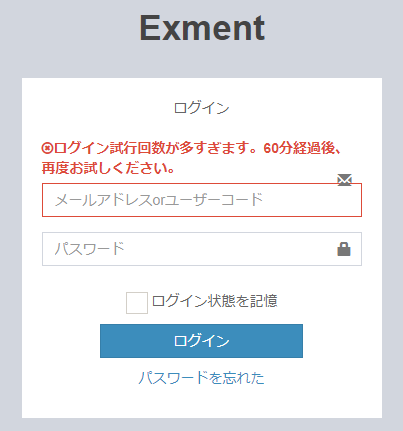
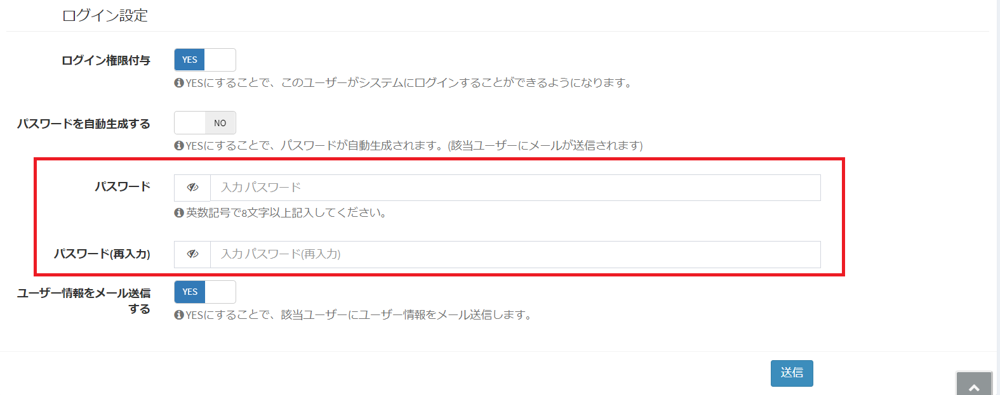

# User / Login user
Manage users who use this system or login users.

## Name definition
#### User
An employee or person belonging to your company or organization.  
If you don't use this system, you can still add it as a user.  
User code and e-mail address are required.  
You can link users and register them by linking them to other tables, but you cannot log in to the system.  

#### Login user
This is the employee / person who can log in to Exment.  
Since a password is assigned to the user information, you can log in from the Exment login screen, and you can register and reference data.  

#### User and login user setting procedure

The flow before you can log in to Exment is as above.  
① On the user management screen, register the user's user code, user name, and e-mail address.  
After that, set the password of the user registered in ① on the login user management screen in ②.  
The registered user can now log in to Exment.  

> If a user sets a wrong password a certain number of times during login, the user will not be able to log in for a certain period of time.  

## User management
Describes how to manage all user information.

### List screen display
Click "Users" from the left menu.  
Or access the following URL.  
This will display the user settings screen. http(s)://(Exment URL)/admin/ data / user  
A list of users currently registered in the system is displayed.  

### Add new user
- On the "User" list screen, click the "New" button at the top right of the page.

- A new addition screen will be displayed. Enter necessary information.

#### Affiliation organization setting
If there is an organization to which the user belongs, select from the candidate data list and move to the selected data.
※ If the organization has not been created, this item will not be displayed.

#### Role group settings
If there is a role group to be assigned to the user, select from the candidate data list and move to the selected data.

#### Login settings
By setting the login authority to YES, you can create a user as a login user. Please refer to the following [login user management](#login-user-management) for the setting method.

### Save
After filling in the settings, click “Submit”.

### Edit
If you want to edit a user, click the "Edit" link in the appropriate row.

### Delete
To delete a user, click the "Delete" link in the corresponding row.

## Login user management
Manage login users based on the user created on the above screen.  
You can add password information, reissue a password, delete login authority, etc.

### Screen display
Click "Login User" from the left menu.  
Or access the following URL.  
This will display the user settings screen. http(s):// (URL of Exment) / loginuser Displays the users  
currently registered in the system and their login information.  

### Add login information
Click the "Edit" link in the row of the user for whom you want to add login information.  

The login information edit screen is displayed.  

To add login authority, set "Login authority" to YES.  
By selecting YES, the "Automatically generate password" item will be displayed.

#### Automatically generate password
If YES, automatically generate a password when adding login authority.  
After automatic generation, a password e-mail is automatically sent to the corresponding e-mail address.  
**※ To execute this function, you need to configure the [mail settings](/system_setting#System-mail-settings).**  

If NO, a text box for entering the password and the item "Send User Information by Email" will be displayed.  

#### Password input
Displayed when "Automatically generate password" is NO.  
Enter the password of the login user.  

#### Email user information
Displayed when "Automatically generate password" is NO.  
If this item is YES, a password email will be sent to the appropriate email address.  
**※ To execute this function, you need to configure the [mail settings](/system_setting#System-mail-settings).**

### Delete login authority
Delete login authority.  
On the list screen, click the "Edit" link of the user whose column "Login user setting" is "YES".  
  

Change "Login Authorization" to NO.  
  

Then, click "Send".